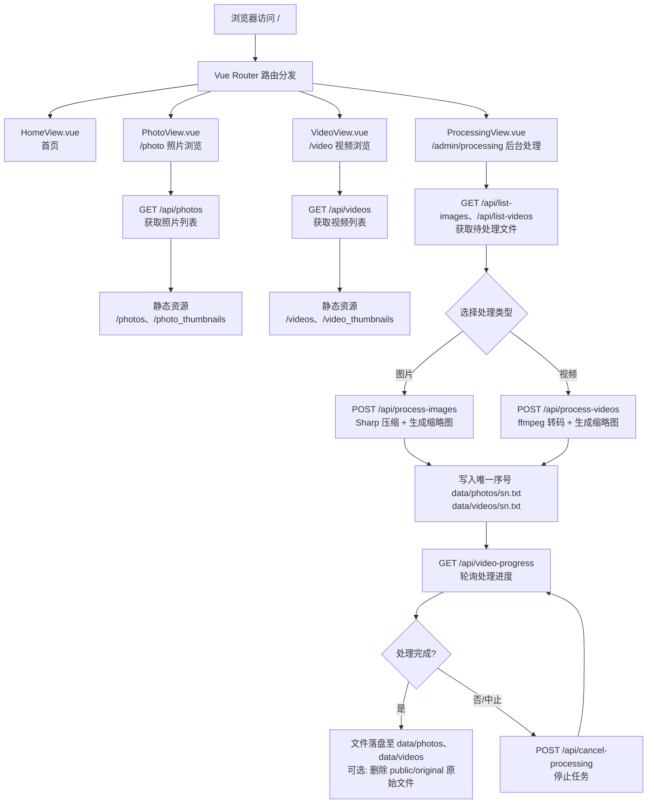

# Project Guidelines

## 项目流程图 (Project Flow)

## Technology Stack

- **前端**: Vue.js 3 + Vite + Vue Router(`src/`)
- **后端**: Node.js + Express(`backend/`,分层结构)
- **媒体处理**: Sharp(图片)、fluent-ffmpeg + ffmpeg/ffprobe(视频)
- **存储**: 文件系统,无数据库;唯一序号记录在 `data/photos/sn.txt`、`data/videos/sn.txt`
- **部署**: PM2(`ecosystem.config.js`)+ Nginx(`nginx.conf.template`)

## Code Style

- 后端使用 CommonJS(`require`),前端使用 ES Modules(`import`)— 不要混用
- 使用 async/await — 不要使用原始回调或 `.then()` 链
- 使用 2 空格缩进
- 保持中英双语注释风格,与现有代码一致
- 路径一律使用 `path.join()` 构建,不要硬编码绝对路径或拼接字符串

## Architecture

- 后端分层:`backend/src/{config,utils,services,routes}`,入口 `backend/server.js` 薄封装;处理状态集中 `backend/src/state.js`
- 数据目录结构:原始文件 `public/original/{images,videos}`,处理后文件 `data/{photos,videos}`,缩略图 `data/{photo_thumbnails,video_thumbnails}`
- API 前缀统一为 `/api`,静态资源挂载于 `/photos`、`/videos`、`/photo_thumbnails`、`/video_thumbnails`
- 前端页面组件位于 `src/views/`,复用组件位于 `src/components/`,路由定义在 `src/router/index.js`

## Testing

- 后端测试:`cd backend && npm test`(node:test,27 个测试)
- 修改 API 后使用 `npm run dev` + `cd backend && node server.js` 手动验证前后端联调

## Security

- 所有安全相关变更必须遵循仓库根目录 `SECURITY.md` 的强制安全规则
- 不要直接记录用户提供的输入内容
- 所有接收文件名的 API 参数必须先校验(防止路径遍历),再访问文件系统
- 环境变量通过 `backend/.env` 加载,敏感配置不要写入代码或提交到仓库
